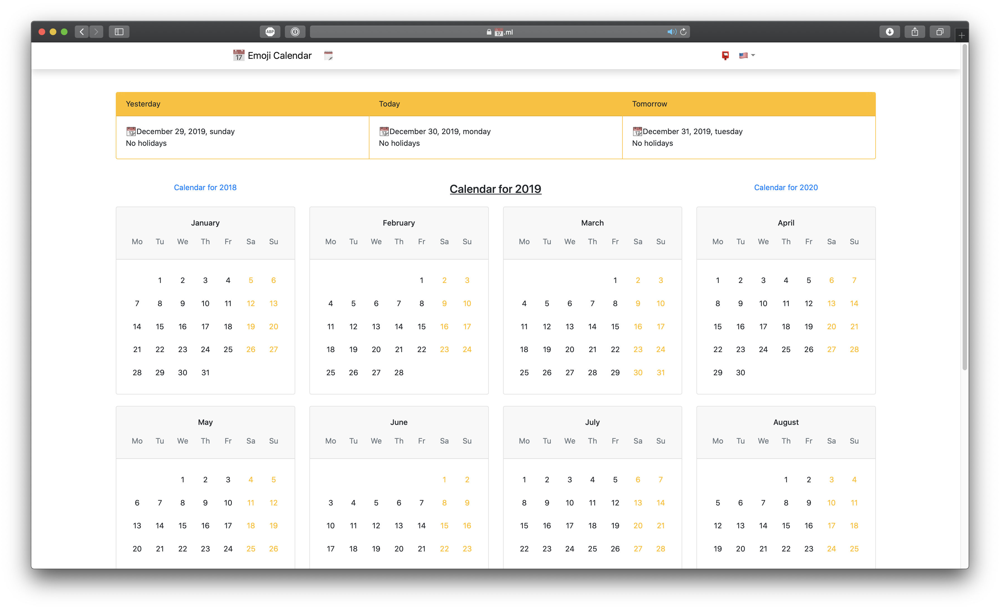

    

<h3 align="center">Emoji Calendar</h3>

## Contact
If you have any problems, you can [open a new issue](https://github.com/tophackr/EmojiCalendar/issues/new) or write an [email](mailto:tophackr@icloud.com).

## Copyright and license
Code copyright 2020 the [Emoji Calendar authors](https://github.com/tophackr/emojicalendar/graphs/contributors). Code released under the [MIT License](https://github.com/tophackr/EmojiCalendar/blob/master/LICENSE).
